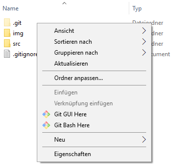
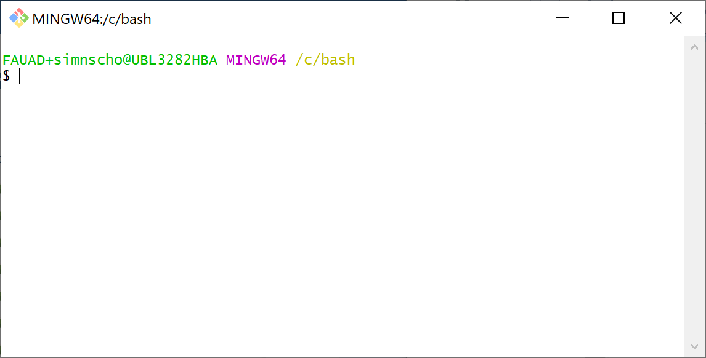
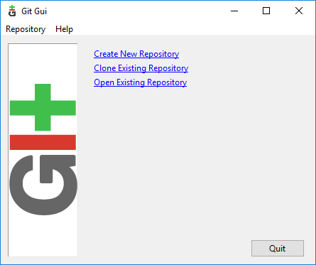
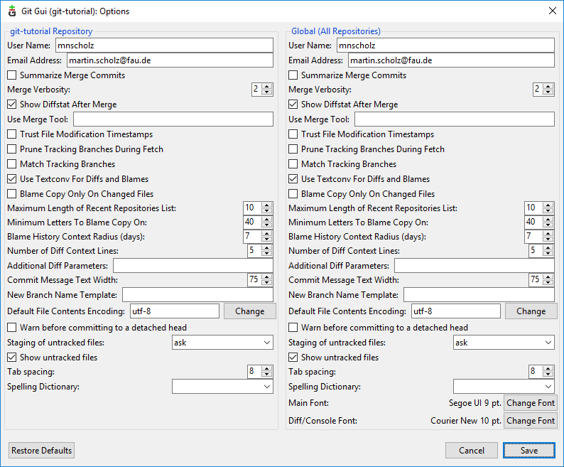
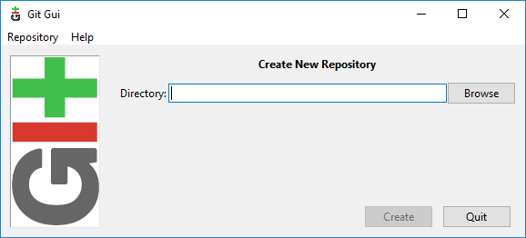
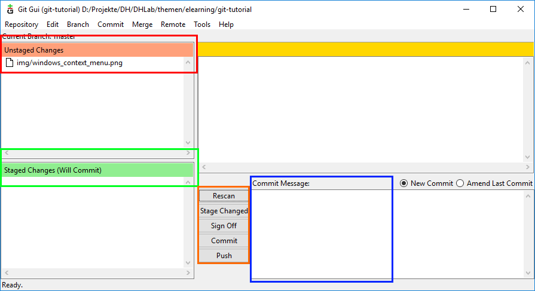
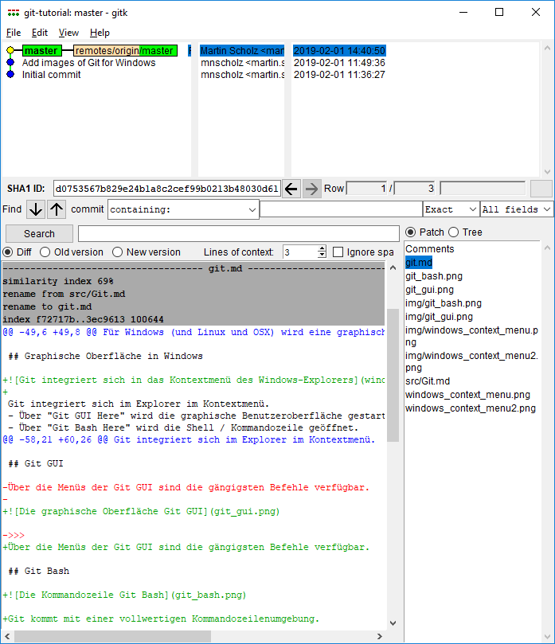

# Eine kurze Einführung in Git, GitHub und GitLab

- - - - - - - - - - - - - - - - - - -


## Git 

[Git](http://git-scm.com/) ist ein Source Code Management System. 
- Repository: zusammen verwaltete Dateien und Verzeichnisse
- Dateienversionen verwalten
  - Snapshots
  - Alternativen
  - Diffs (Änderungen sichtbar machen)
- Dezentral verteiltes arbeiten

==> Optimiert für Programmcode / *Textdateien* (txt, csv, xml, html, tex, ...)


## Git und GitHub|GitLab

Git ist das grundlegende Werkzeug.

[GitHub](https://github.com/), [GitLab](https://gitlab.com), [Bitbucket](https://bitbucket.org/), u.a. sind Plattformen, die Dienstleistungen rund um Git anbieten:
- Hosting von und Zugriff auf Dateien mittels Git
- Projektverwaltung
- Werkzeuge zur Kollaboration
- web-basierte graphische Oberfläche
- Präsentation / Werbung / Sichtbarkeit


## GitHub

GitHub ist ein kostenlos nutzbares, jedoch kommerzielles Angebot von Microsoft.

- Die bekannteste und populärste Plattform
- Kostenlose öffentliche und private Repositories


## GitLab

GitLab ist eine (ebenfalls kommerzielle) Alternative zu GitHub. 
Der Quellcode ist im Gegensatz zu GitHub aber *Open Source*.
Daher wird es zum Aufsetzen eigener GitHub-Alternativen verwendet.

Das RRZE betreibt GitLab für alle FAU-Angehörigen in [zwei Varianten](https://www.rrze.fau.de/serverdienste/infrastruktur/gitlab/).
- Auf Gitos Anmeldung für Nicht-FAU-Angehörige möglich.
- Im Zweifel gitos verwenden.


## Warum GitHub|GitLab verwenden?

- Hosting, Sicherung 
- Arbeitsplatzunabhängiges Arbeiten
- Teilen / Veröffentlichen
- Kollaborativ arbeiten
- Pages: Eigene kleine Webseiten hosten ([GitHub](https://pages.github.com/)|[GitLab](https://docs.gitlab.com/ee/user/project/pages/))
- Issue/Ticket-System und Wiki
- CD/CI: Automatisch Aufgaben ausführen ([GitHub]()|[GitLab]())
- Graphische Web-Editoren


## Links

- https://github.com/dhlab-ub-fau-de/git-github-gitlab-tutorial
- [Einführung auf StudOn](https://www.studon.fau.de/pg571251_2993840.html)
- [An Introduction to Version Control Using GitHub Desktop](https://programminghistorian.org/en/lessons/retired/getting-started-with-github-desktop)
- [Version Control with Git](https://swcarpentry.github.io/git-novice/)
- [Tutorials, Videos, Bücher der Git-Webseite](https://git-scm.com/book/en/v2)
- [Tutorials auf GitHub](http://try.github.io/)
- https://www.youtube.com/watch?v=0Im_FrvLxXo


## Git installieren

- [Für Windows](http://gitforwindows.com/) gibt es einen Installer.

- Für Linux oder OSX gibt es entsprechende Paketquellen.


## Benutzung

Git selbst ist ein Kommandozeilenprogramm. Man bedient es über Befehle auf der Kommandozeile:

```git <kommando> <parameter>...```


## Graphische Benutzeroberflächen

- Es gibt zahlreiche graphische Benutzeroberflächen.
- Auf der Webseite von Git findet sich [eine Auswahl](https://git-scm.com/download/gui/windows).
- Git für Windows kommt mit einer rudimentären GUI.
- [TortoiseGit](https://tortoisegit.org/) bedient man über das Kontextmenü des Windows-Explorers


## Git GUI in Windows

<div>


</div>
<!-- .element class="image-on-right" -->

<div>
Git integriert sich ins Kontextmenü des Explorers.
- Über "Git GUI Here" wird die graphische Benutzeroberfläche gestartet.
- Über "Git Bash Here" wird die Shell / Kommandozeile geöffnet.

Git kommt mit einer vollwertigen Kommandozeilenumgebung.

Über die Menüs der Git GUI sind die gängigsten Befehle verfügbar.
</div>
<!-- .element class="content-on-left" -->


## Verteiltes Arbeiten

Die Stärke von Git ist das einfache verteilte Arbeiten an gemeinsam genutzten Dateien.

Dazu wird das Repository an verschiedenen Orten vorgehalten (local und remote).

Git managed die Synchronisation der Repositorykopien.


## Verteilte Repositories

Git kennt prinzipiell keine Hierarchie zwischen Repositories. In der Praxis hat sich folgender Aufbau bewährt:

- Zentrales Haupt-Repository auf einem Server (GitHub, GitLab, ...).
- Lokale Arbeitskopien des Repositories.


## Eine lokale Arbeitskopie erzeugen

Das Erzeugen einer Kopie nennt man *klonen*.

Da Git Arbeitskopien ermuntert, ist klonen sehr einfach.

Man braucht dazu die URL des zentralen Repositorys.


### Die URL des zentralen Repository


### Einen Klon erzeugen (GUI)

<div>


</div>
<!-- .element class="image-on-right" -->

<div>
Im Explorer außerhalb eines Repositorys die Git GUI aufrufen.

Wenn `Clone Existing Repository` ausgewählt wird, erscheint ein Dialog zur Eingabe der Repository-URL.
</div>
<!-- .element class="content-on-left" -->


## Vor dem Arbeiten: Konfiguration

Git will mindestens Name und Mail-Adresse kennen, die es als Provenienzangaben benutzt.


## Konfiguration (GUI)

<div>

</div>
<!-- .element class="image-on-right" -->

<div>
Unter `Edit > Options` finden sich die Einstellungen.

Git unterscheidet zwischen globalen und Repository-bezogenen Einstellungen.
</div>
<!-- .element class="content-on-left" -->


## Konfiguration (Bash)

`git config --global user.name <Name>` setzt den Namen.

`git config --global user.email <Mail>` setzt die Mail-Adresse.

Für Repository-bezogene Einstellungen lässt man `--global`weg.


## Versionsverwaltung von Dateien

- Die oberste Gliederungseinheit in Git ist ein Repository.
- Ein Repository ist ein (normales) Verzeichnis.
- Dateien und Verzeichnisse in einem Repository werden gemeinsam verwaltet.


## Ein Repository anlegen

- Man kann entweder ein neues Verzeichnis als Repository erstellen oder ein bestehendes umwandeln.
- Im Repository legt Git ein Verzeichnis `.git` an, in dem es die Verwaltungsdaten ablegt. Dieses Verzeichnis sollte **nicht** verändert werden!


### Ein Repository anlegen (GUI)

<div>


</div>
<!-- .element class="image-on-right" -->

Beim Starten der GUI in einem Verzeichnis, das kein Repository ist, kann ein neues Repo erzeugt werden.

Das Verzeichnis muss angegeben werden. Im Auswahldialog einfach "Ordner auswählen" drücken.


### Ein Repository anlegen (Bash)

In das entprechende Verzeichnis wechseln und mit 

`git init` ein Repository anlegen.


## Versionen erstellen und verwalten

Ein *Commit*...
- ist ein Schnappschuss eines Repositorys zu einem bestimmten Zeitpunkt,
- erstellt und sichert die Version und Zustand der Dateien und Verzeichnisse,
- hat eine Log-Meldung,
- hat einen oder mehrere chronologische Vorläufer und
- ist durch einen Hashwert eindeutig identifiziert.


### Staging: Vorbereiten eines Commits

- Git nimmt in ein Commit nur explizit genannte Dateien auf.
- Mit dem Staging sagt man Git, dass es eine Datei für das nächste Commit vormerken soll.


### Staging und Commit (GUI)

<div>

</div>
<!-- .element class="image-on-right" style="width: 50%;" -->
 
Die Listen rechts zeigen an, welche Dateien geändert wurden und welche davon vorgemerkt sind (rot und grün).

Über `Stage changed` können alle geänderten Dateien vorgemerkt werden.

Vor dem `Commit` muss eine Commit Message eingegeben werden (blau).


### Staging und Commit (Bash)

`git add <Datei oder Verzeichnis>` merkt Dateien oder komplette Verzeichnisse vor.
`git add .` merkt alle Änderungen im aktuellen Verzeichnis und in Unterverzeichnissen vor.

`git commit` erstellt ein Commit. In einem Editor muss man eine Commit-Meldung erstellen.
Alternativ kann die Option `-m <Meldung>` benutzt werden.


## Versionshistorie

Man kann in Git...
- sich die Versionshistorie mit Meldungen und Änderungen anzeigen lassen und
- eine bestimmte Version *auschecken*, das heißt, das Repository auf diesen Commit zurücksetzen.

Es gibt für Git verschiedenste Werkzeuge und Wege dafür.


### Versionshistorie anschauen (GUI)

<div>

</div>
<!-- .element class="image-on-right" -->

Über `Repository > Visualize master's History` ist die Historie anzeigbar.

Es gibt zahlreiche Einstellmöglichkeiten. Einfach ausprobieren, was nützt!


### Versionshistorie anschauen (Bash)

`git log` zeigt eine Liste der letzten Commits mit Meldungen.

`git diff` zeigt zeilenweise die Änderungen seit dem letzten Commit. 

`git diff A..B [<Datei>]` zeigt die Änderungen zwischen Commit A und Commit B.

`git diff A..HEAD` zeigt Änderungen zwischen A und dem letzten Commit.


### Version auschecken (GUI)

Unter `Branch > Checkout...` kann ein beliebiger Commit ausgewählt werden.


### Version auschecken (Bash)

`git checkout <Commit-Hash>` checkt die angegebene Version aus.


## Varianten und Zweige

Beziehungen zwischen Commits können nicht nur chronologische *Änderungen* darstellen, sondern auch
  inhaltliche *Varianten*.


## Zweige

<div>

<span class="small">https://github.com/kitodo/kitodo-production/network</span>
</div>
<!-- .element class="image-on-right" -->

<div>
Varianten werden durch Zweige, sogenannte *Branches*, realisiert.

Zweige können abgespalten und wieder zusammengeführt werden.

Dadurch entsteht eine graphartige Struktur.
</div>
<!-- .element class="content-on-left" -->


### Einen Zweig erstellen (GUI)

`Branch > Create...` erstellt einen neuen Zweig. Dieser muss und sollte einen sprechenden Namen bekommen.

Git benennt den Hauptzweig standardmäßig `main`.


### Einen Zweig erstellen (Bash)

`git branch <Branch-Name>` erzeugt einen neuen Branch.


