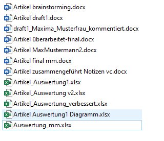
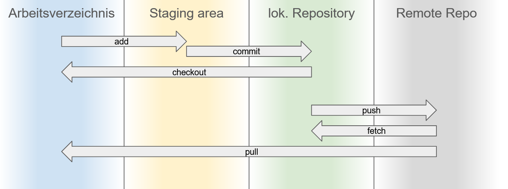

<!-- .element class="aligned-center title-page" -->
# Versionsverwaltung und <br/> Kollaboratives Arbeiten <br/> mit Git, GitLab und GitHub

- - - - - - - - - - - - - - - - - - -

https://github.com/mnscholz/git-github-gitlab-tutorial


## Typische Probleme 

- Dateihistorie
- Nachvollziehbarkeit von Änderungen


<!-- .element class="image-on-left" -->


## Git 

[Git](http://git-scm.com/) ist das meist genutzte Source Code Management System <br/>
unter anderem für Entwicklung von Linux, Windows, ...

- Repository: zusammen verwaltete Dateien und Verzeichnisse
- Dateiversionen verwalten
  - Snapshots
  - Alternativen
  - Diffs (Änderungen sichtbar machen)
- Dezentral verteiltes Arbeiten

⚠ Optimiert für Programmcode / *Textdateien* (txt, csv, xml, html, tex, ...)


## Git und GitHub|GitLab

Git ist das basale Werkzeug.

[GitHub](https://github.com/), [GitLab](https://gitlab.com), u.a. sind darauf aufbauende Plattformen.
- Ablage von und Zugriff auf Dateien mittels Git und Browser
- Projektverwaltung
- Werkzeuge zur Kollaboration
- web-basierte graphische Oberfläche
- Präsentation / Sichtbarkeit / (Archivierung)

😎 Nur rudimentäre Git-Kenntnisse nötig!


## GitHub

[GitHub](https://github.com) ist ein kommerzielles Angebot von Microsoft.

- Die bekannteste und populärste Plattform
- Kostenlose öffentliche und private Repositories
- Verlangt 2FA zum Anmelden und Schlüssel / Tokens zum Synchronisieren


## GitLab

GitLab ist eine ebenfalls kommerzielle Alternative zu GitHub.<br/>
Das betreiben eigener Instanzen ist möglich.

Das RRZE betreibt GitLab für alle FAU-Angehörigen in [zwei Varianten](https://www.rrze.fau.de/serverdienste/infrastruktur/gitlab/).
- Variante Gitos erlaubt die Anmeldung auch für Nicht-FAU-Angehörige
- Für Nutzung von Gitlab muss man sich im IDM freischalten


## Warum GitHub|GitLab verwenden?

- Arbeitsplatzunabhängige Dateiablage
- Versionskontrolle
- Hosting, Sicherung 
- Kollaborativ arbeiten
- Wiki und Issue/Ticket-System
- Graphische Web-Editoren
- Pages: Eigene statische Webseiten hosten 
- CD/CI: Automatisch Aufgaben ausführen


## Wann ist GitHub|GitLab eher nicht geeignet?

- reine Dateiablage á la FAUbox, Dropbox, ...
- (Große) Binärdateien
- Gleichzeitiges gemeinsames Editieren eines einzelnen Dokuments á la Google Docs


## Git installieren

- Für Windows gibt es einen [Installer](http://gitforwindows.com/).
- Für Linux oder OSX gibt es entsprechende Paketquellen.


## Benutzung


<!-- .element class="image-on-right" -->

Git selbst bedient man ausschließlich über Befehle auf der Kommandozeile:

```git <kommando> <parameter>...```

Git für Windows kommt mit einer vollwertigen Kommandozeilenumgebung.


## Graphische Benutzeroberflächen

- Es gibt zahlreiche graphische Benutzeroberflächen.
- Auf der Webseite von Git findet sich [eine Auswahl](https://git-scm.com/download/gui/windows).
- Git für Windows kommt mit einer enfachen GUI.
- [TortoiseGit](https://tortoisegit.org/) integriert sich in den Windows-Explorer.
- [GitHub Desktop](https://desktop.github.com) ist speziell für GitHub konzipiert. 


## Links

- [Git Pro](https://git-scm.com/book/en/v2) ("offizielles" Buch, kostenlos)
- [Version Control with Git](https://swcarpentry.github.io/git-novice/) (Software Carpentries)
- [An Introduction to Version Control Using GitHub Desktop](https://programminghistorian.org/en/lessons/retired/getting-started-with-github-desktop)
- [Einführung in Git](https://www.studon.fau.de/pg571251_2993840.html) (StudOn)
- [Tutorials auf GitHub](http://try.github.io/)
- [Git Crash-Kurs - Tobias Günther - Macoun 2011](https://www.youtube.com/watch?v=0Im_FrvLxXo) (Youtube)

- [Anleitung SSH und Keys mit GitHub](https://docs.github.com/de/authentication/connecting-to-github-with-ssh) (analog für GitLab)


## Demo


<!-- .element class="image-on-right" -->

Diese Slides ...
- auf dem lokalen Rechner
- auf [GitLab des RRZE](https://gitos.rrze.fau.de/simnscho/git-github-gitlab-tutorial)
- auf [GitHub](https://github.com/mnscholz/git-github-gitlab-tutorial)


## Verteiltes Arbeiten

Die Stärke von Git ist das einfache verteilte Arbeiten an gemeinsam genutzten Dateien.

Dazu wird das Repository an verschiedenen Orten vorgehalten.
- *local* und *remote*

Git managed die Synchronisation der Repositorykopien.


## Verteilte Repositories


<!-- .element class="image-on-right" -->

Git kennt prinzipiell keine Hierarchie zwischen Repositories. In der Praxis hat sich folgender Aufbau bewährt:

- Zentrales Haupt-Repository auf einem Server (GitHub, GitLab, ...).
- Lokale Arbeitskopien des Repositorys.
- Bei komplexeren Projekten werden *Forks* als Zwischenstufen genutzt


## Eine lokale Arbeitskopie erzeugen


<!-- .element class="image-on-right" -->

Das Erzeugen einer Kopie nennt man *klonen*.

Da Git Arbeitskopien ermuntert, ist klonen sehr einfach.

Man braucht dazu die URL des zentralen Repositorys.


## Vor dem Arbeiten: Konfiguration


<!-- .element class="image-on-right" -->

Git will mindestens Name und Mail-Adresse kennen, die es als Provenienzangaben benutzt.


## Versionsverwaltung von Dateien

- Ein Repository ist ein (normales) Verzeichnis.
- Dateien und Verzeichnisse in einem Repository werden gemeinsam verwaltet.
- Man kann entweder ein neues Verzeichnis als Repository erstellen oder ein bestehendes umwandeln.

⚠ Im Repository legt Git ein Verzeichnis `.git` an, in dem es die Verwaltungsdaten ablegt. Dieses Verzeichnis **darf nicht** verändert oder gar gelöscht werden!


## Versionen speichern und verwalten

Ein *Commit*...
- ist ein Schnappschuss des Repositorys zu einem Zeitpunkt,
- sichert Zustand der Dateien und Verzeichnisse,
- hat eine Log-Meldung,
- hat einen oder mehrere chronologische Vorläufer und
- ist durch einen Hashwert eindeutig identifiziert.

⚠ Nur ein Commit hält Änderungen dauerhaft fest!


## Versionsverwaltung:<br/> Schritte und Datenfluss in Git




## Staging: Vorbereiten eines Commits

- Git nimmt in ein Commit nur explizit genannte Dateien auf.
- Mit dem Staging sagt man Git, dass es eine Datei für das nächste Commit *vormerken* soll.


## Wozu Staging?

**Saubere Commits!**

- Jedes Commit sollte thematisch abgeschlossen sein.
- Geänderte Dateien, die thematisch nicht zu einem Commit passen, werden ausgespart
- Commits können von Git rückgängig gemacht werden


## Varianten und Zweige

Beziehungen zwischen Commits können nicht nur chronologische *Änderungen* darstellen, sondern auch
  inhaltliche *Varianten*.

Das Zusammenführen von Varianten wird *Merge* genannt.
- meist kann Git automatisch Mergen
- Konflikte müssen händisch aufgelöst werden


## Zweige

<div>

<span class="small">https://github.com/kitodo/kitodo-production/network</span>
</div>
<!-- .element class="image-on-right" -->

<div>
Varianten werden durch Zweige, sogenannte *Branches*, realisiert.

Zweige können abgespalten und wieder zusammengeführt (gemergt) werden.

Dadurch entsteht eine graphartige Struktur.
</div>
<!-- .element class="content-on-left" -->


## Versionshistorie


<!-- .element class="image-on-right" -->

Man kann in Git...
- sich die Versionshistorie mit Meldungen und Änderungen anzeigen lassen und
- eine bestimmte Version *auschecken*, das heißt, das Repository auf diesen Commit zurücksetzen.

Es gibt für Git verschiedenste Werkzeuge und Wege dafür.


## Beispiele auf GitHub ...

- für ein Software-Projekt: [Kitodo.Production](https://github.com/kitodo/kitodo-production)
- für eine Publikationsverwaltung: [Programming Historian](https://github.com/programminghistorian/jekyll)


<!-- .element class="aligned-center title-page" -->
# Vielen Dank für die Aufmerksamkeit!

Fragen?


